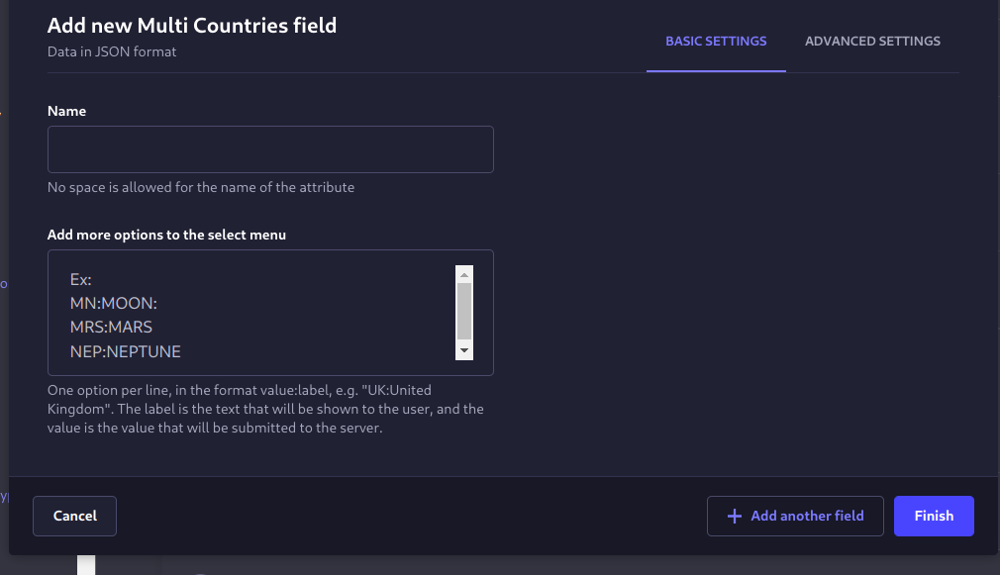

# Strapi plugin multi-country-select

A strapi custom field for selecting multiple countries based on the ISO 3166-1 country code standard.

## Installation

To install this plugin, you need to add an NPM dependency to your Strapi application:

```
# Using Yarn
yarn add strapi-plugin-multi-country-select

# Or using NPM
npm install strapi-plugin-multi-country-select
```

Then, you'll need to build your admin panel:

```
# Using Yarn
yarn build

# Or using NPM
npm run build
```


## Usage

After installation you will find the multi-country-select at the custom fields section of the content-type builder.


Now you can select multiple counties from the list. The Alpha-2 code of the selected countries is stored as an array in the database.


You can also add more options to the select field.


If you add an option with the the value "ALL" (and any label), once you select this option all the countries will be deselected and the options will be disabled.

`All countries:ALL`


## Related

- [i18n-iso-countries](https://github.com/michaelwittig/node-i18n-iso-countries) - i18n for ISO 3166-1 country codes

- Forked and modified from [strapi-plugin-country-select](https://github.com/ChrisEbert/strapi-plugin-country-select)